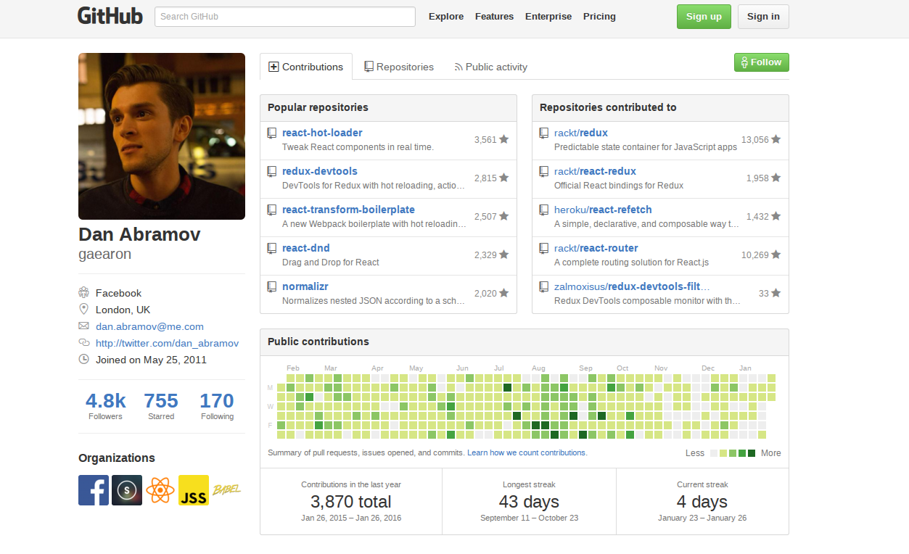

Jak zostać front-end developerem w 3 miesiące?
===

---

## O mnie

Anna Konopka
- front-end developer w PGS Software
- współorganizatorka spotkań wrocławskich Karotek
- prowadząca blog [Bookie & Cookie](bookieandcookie.blogspot.com)

Note:
blog - nowe technologie, damskie spojrzenie na świat IT

---

##Czy da się?

Note:
- temat kontrowersyjny
- w 3 miesiace bardzo duzo
- czego sie nauczyc, jak zostac junior front-end developerem
- na 2 etapy - narzedzia + tips & tricks
---

##Moja historia

<!-- .element: style="width:350px;" -->

Note:
- rodzice informatycy, brat - początkujący programista - nie chce
- lubie matematyke, fizyke - jestem całkiem dobra -> studia na politechnice
- programowanie na studiach -> spoko, ale nie porwało
- ubzdurałam sobie front-end, nie majac do końca świadomości z czym to sie je
- praca inzynierska - AngularJS
- praktyki - .Net -> nie mój klimat
- praktyki - frontend -taaaaaak love, love
- warsztaty - python
- pracuje od 4 miesiecy, nauczylam sie mnostwo

---

<!-- .slide: data-background="super.gif" -->

##Front-end jest super!
<!--.element: style="color:white; text-shadow: 0 0 10px black; position: relative; top: 350px;"  -->

Note:
- bardzo szybko sie rozwija
- można się dużo nauczyć
- otwarta społeczność - open source'a + github
- frontend popularny
- nie bede Wam opowiadac o rzeczach oczywistych html, css, o tym o czym wszedzie uslyszycie

---

##GIT

<!--.element: style="width:400px; "  -->

- git init
- git add
- git commit
- git branch
- git checkout
- git status
- git log
- git push/pull

Note:
- po co?
- komendy
- trzymać swoje projekty w gicie, żeby się ćwiczyć
- wrzucać swoje projekty na githuba -> uczysz się + budujesz portfolio

---

## Node.js + npm

Note:
- node.js - silnik js bez przeglądarki, uruchamiamy w tym swoje narzedzia
  np. narzędzia do budowania
- npm - package manager dla node.js, popularny w front-endzie,
  dzięki niemy możemy ściągać moduły napisane przez innych i udostępnione jako
  moduł npm
- npm - bardzo dużo bibliotek js + potrzebujesz czegoś - 99% znajdziesz
- umieć zainstalować

---

#bower

<!--.element: style="width:400px"  -->

Note:
- powoli się odchodzi od tego
- bower tylko jedna wersja, chcemy mniej rzeczy ładować, lżej - przeglądarka
- front-end moduły - np. angular, bootstrap

---

#Narzędzia do budowania

<!--.element: style="width: 200px; padding-left: 70px"  -->

<!--.element: style="width: 300px;"  -->

Note:
 - po co? gdy projekt skomplikowany,
 - kompilacja sass, less, es6 -> inne jezyki
 - minifikacja, uruchamianie testów, sprawdzanie składni
 - grunt, gulp -> uruchamiamy zadania, które za nas wykonują część pracy, którą
  można zautomatyzować
 - webpack - trochę wyższa szkoła jazdy

---

#Chrome DevTools

<!--.element: style="border: 1px solid #586e75"  -->
[Chrome DevTools - intro](https://developer.chrome.com/devtools)

Note:
 - absolute must
 - consola JS
 - mamy ładnie rozrysowane aktualne drzewo DOM - wszystkie elementy znajdujące się na stronie
 - network tab - wszystkie zapytania po zasoby, inne skrypty czy dane
 - zaawansowane narzędzia - timeline - profilowanie - mierzenie wydajności aplikacji

---

## Tips & tricks  

Note:
 - wszystko już ładnie umiemy, ale chcielibyśmy zwiększyć szansę na zostanie junior
 front-end developerem

---

##Trzeba chcieć się uczyć!

<!--.element: style="width:600px;"  -->

Note:
- front-end to bardzo rozwijająca się dziedzina
- zdecydowanie trzeba sie duzo uczyc caly czas - i trzeba to lubić
- umiejetnosc szybkiego dostosowania sie do warunkow jest mile widziala
- open source - wszyscy tworza - spolecznosc sie rozwija

---

<!--.element: style="width:450px;"  -->

<!--.element: style="width:450px;"  -->

<!--.element: style="width:450px;"  -->

<!--.element: style="width:450px;"  -->

[blogpost: 5 najlepszych platform do nauki programowania](http://bookieandcookie.blogspot.com/2015/09/5-najlepszych-platform-do-nauki-programowania.html)

Note:
- skoro wiemy chcemy sie nauczyc musimy jeszcze miec skad
- stackoverflow - społeczność, pomoc

---

##Github - portfolio

<!--.element: style="width:800px;"  -->

Note:
- przydaje się przy szukaniu pracy/stażu
- wpisać w CV link do githuba
- przechowujemy swoje projekty w chmurze

---

<!--.element: style="width:600px;"  -->

[Pytania rekrutacyjne - front-end](https://github.com/h5bp/Front-end-Developer-Interview-Questions/blob/master/Translations/Polish/README.md) 
[Wymagania dla front-end developera](http://rmurphey.com/blog/2012/04/12/a-baseline-for-front-end-developers)

---

##Bądź na bieżąco

Note:
javascript jabber

---

##Rozwój - morze możliwości
<!--.element: style="color:white; text-shadow: 0 0 10px black;"  -->

<!--.slide: data-background="./sea.gif"  -->

Note:
- reveal.js
- wizytówki znajomym
- staże praktyki

---

##Pytania?

---

<!--.element: style="width:1900px;"  -->
